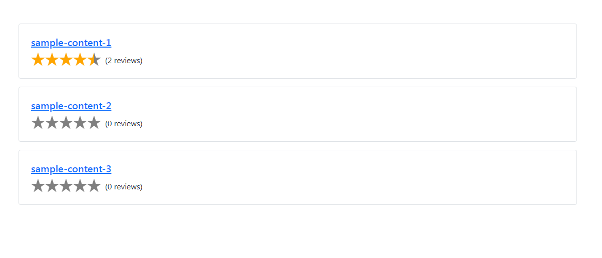
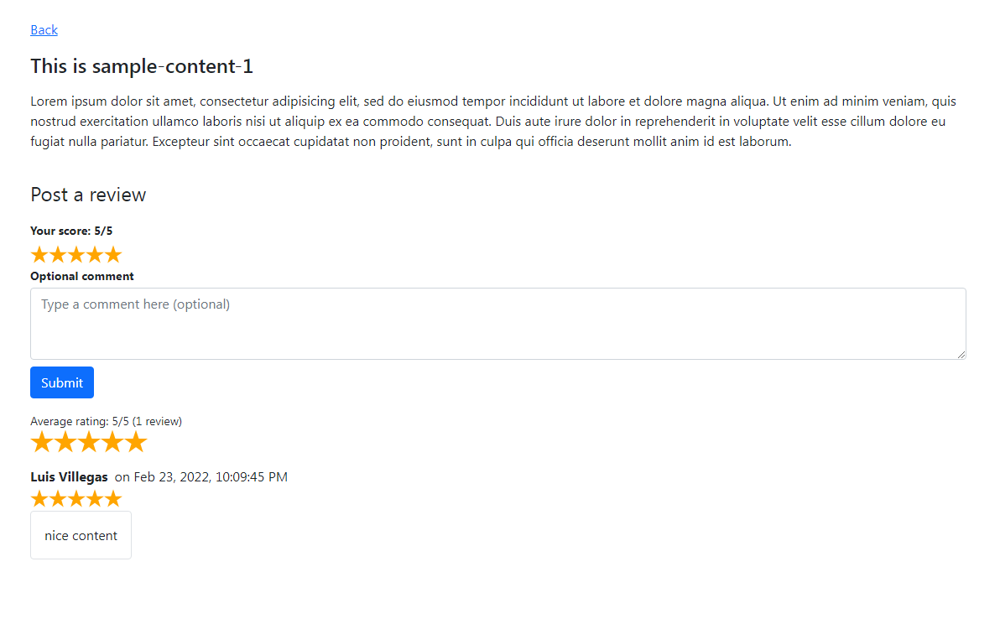

# Sample project that showcases the strapi-ratings-client library

This project showcases how to use the library [strapi-ratings-client](https://npmjs.com/package/strapi-ratings-client) from start to finish, using authenticated users to post reviews and a router to group reviews on their own pages.

## Requirements

You must have a running Strapi V4 application and it must have installed the [Strapi Ratings plugin](https://npmjs.com/package/strapi-plugin-ratings).

Additionally, you must enable the permissions to access the endpoints. More info on this here: https://npmjs.com/package/strapi-plugin-ratings

## Setting up and running

To get up and running just install the dependencies with the command `npm install` and then run the server with `npm run dev` and open up your browser at http://localhost:3000.

